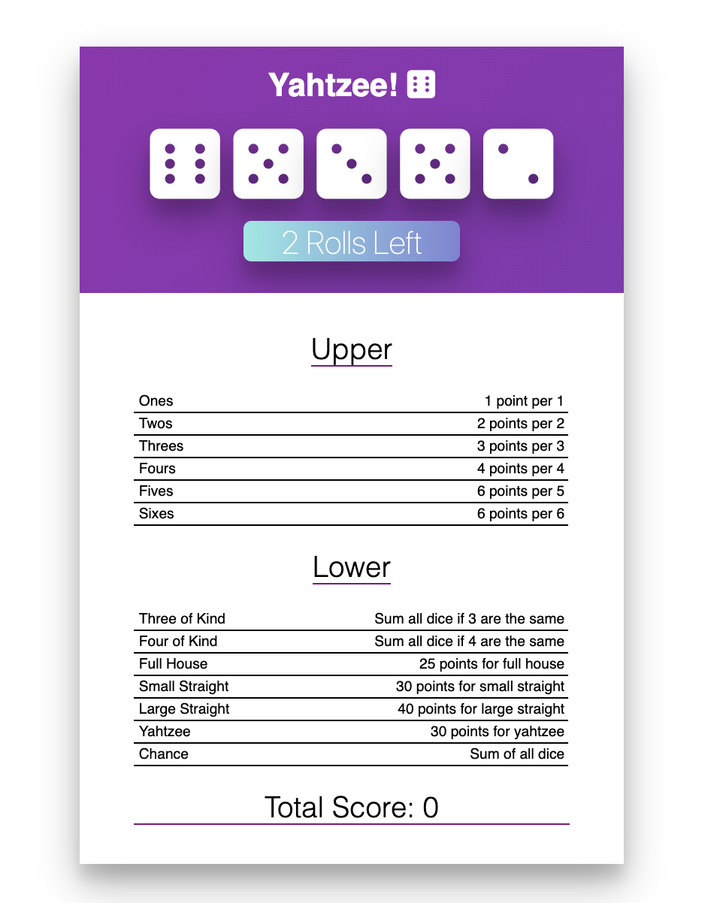

# React Yahtzee

The game of Yahtzee, written with React, React Hooks, SCSS and some OOP Javascript. This work is based on a project in the [Modern React Bootcamp course on Udemy.com](https://www.udemy.com/course/modern-react-bootcamp/). I chose to use React Hooks for state management where possible. 

## The Game
Yahtzee is a chance-and-strategy dice rolling game. A game is played over 13 rounds.

Each round, the player rolls five 6-sided dice. They may click on any number of dice to “freeze” or “unfreeze” them (frozen dice are displayed in a different color). They may re-roll the unfrozen dice up to 2 times.

Each round, they must assign their dice to any unclaimed scoring category. Each category scores differently.

After 13 rounds, the game is over, and the player’s score is the total of each scoring category.

If you are unfamiliar with the [rules of Yahtzee](https://en.wikipedia.org/wiki/Yahtzee#Yahtzee_bonuses_and_Joker_rules).

## Scoring Categories
<table border="1" class="docutils">
<colgroup>
<col width="25%">
<col width="51%">
<col width="24%">
</colgroup>
<thead valign="bottom">
<tr class="row-odd"><th class="head">Category</th>
<th class="head">Description</th>
<th class="head">Example Score</th>
</tr>
</thead>
<tbody valign="top">
<tr class="row-even"><td><strong>Ones</strong></td>
<td>Score 1 for every 1</td>
<td><code class="docutils literal notranslate">1 1 2 3 4</code> = 2</td>
</tr>
<tr class="row-odd"><td><strong>Twos</strong></td>
<td>Score 2 for every 2</td>
<td><code class="docutils literal notranslate">1 2 2 3 4</code> = 4</td>
</tr>
<tr class="row-even"><td><strong>Threes</strong></td>
<td>Score 3 for every 3</td>
<td><code class="docutils literal notranslate">1 2 3 3 3</code> = 9</td>
</tr>
<tr class="row-odd"><td><strong>Fours</strong></td>
<td>Score 4 for every 4</td>
<td><code class="docutils literal notranslate">1 2 4 4 5</code> = 8</td>
</tr>
<tr class="row-even"><td><strong>Fives</strong></td>
<td>Score 5 for every 5</td>
<td><code class="docutils literal notranslate">1 2 5 5 5</code> = 15</td>
</tr>
<tr class="row-odd"><td><strong>Sixes</strong></td>
<td>Score 6 for every 6</td>
<td><code class="docutils literal notranslate">1 2 3 6 6</code> = 12</td>
</tr>
<tr class="row-even"><td><strong>3 of Kind</strong></td>
<td>If 3+ of one value, score sum of all
dice (otherwise, score 0)</td>
<td><code class="docutils literal notranslate">1 2 3 3 3</code> = 12</td>
</tr>
<tr class="row-odd"><td><strong>4 of Kind</strong></td>
<td>If 4+ of one value, score sum of all
dice (else 0)</td>
<td><code class="docutils literal notranslate">1 2 2 2 2</code> = 8</td>
</tr>
<tr class="row-even"><td><strong>Full House</strong></td>
<td>If 3 of one value and 2 of another,
score 25 (else 0)</td>
<td><code class="docutils literal notranslate">2 2 3 3 3</code> = 25</td>
</tr>
<tr class="row-odd"><td><strong>Small Straight</strong></td>
<td>If 4+ values in a row, score 30
(else 0)</td>
<td><code class="docutils literal notranslate">1 2 3 4 6</code> = 30</td>
</tr>
<tr class="row-even"><td><strong>Large Straight</strong></td>
<td>If 5 values in a row, score 40
(else 0)</td>
<td><code class="docutils literal notranslate">1 2 3 4 5</code> = 40</td>
</tr>
<tr class="row-odd"><td><strong>Yahtzee</strong></td>
<td>If all values match, score 50 (else 0)</td>
<td><code class="docutils literal notranslate">2 2 2 2 2</code> = 50</td>
</tr>
<tr class="row-even"><td><strong>Chance</strong></td>
<td>Score sum of all dice</td>
<td><code class="docutils literal notranslate">1 2 3 4 6</code> = 16</td>
</tr>
</tbody>
</table>

## Whats next?
* ~~Deploy to Github Pages so it can be played online~~. <https://shaynemeyer.github.io/react-yahtzee/>
* Add gameover and a way to start a new game.
* Highscores - persist scores to localStorage so that the user can save their highscores.
* Refactor Rules.js to not use JavaScript classes.
* Use websockets to allow you to play the game with a friend.